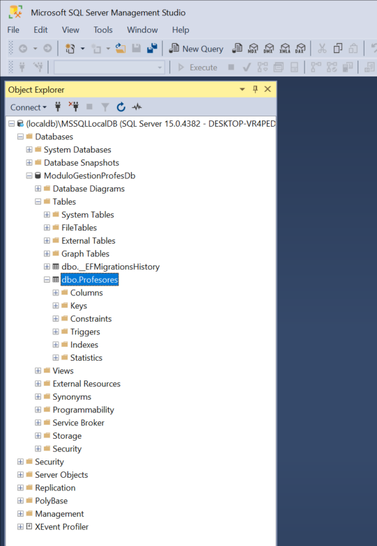
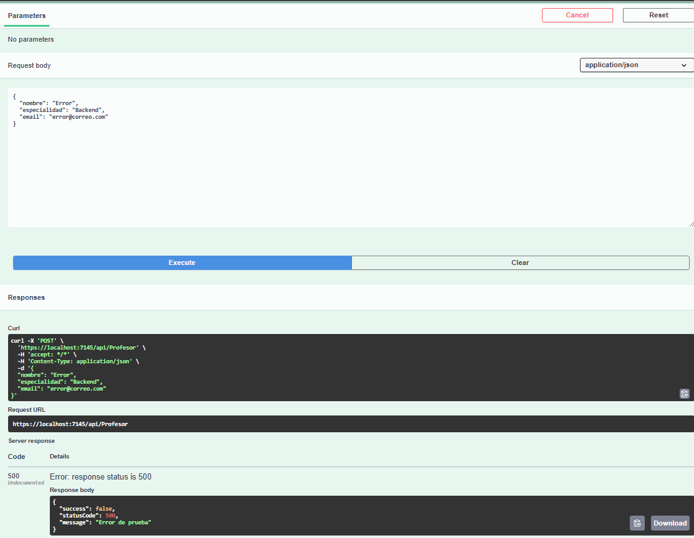
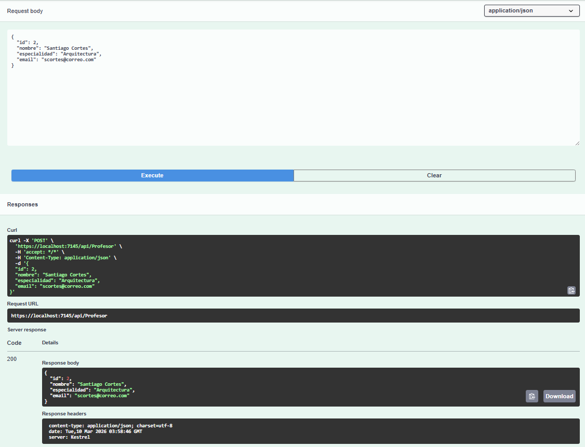
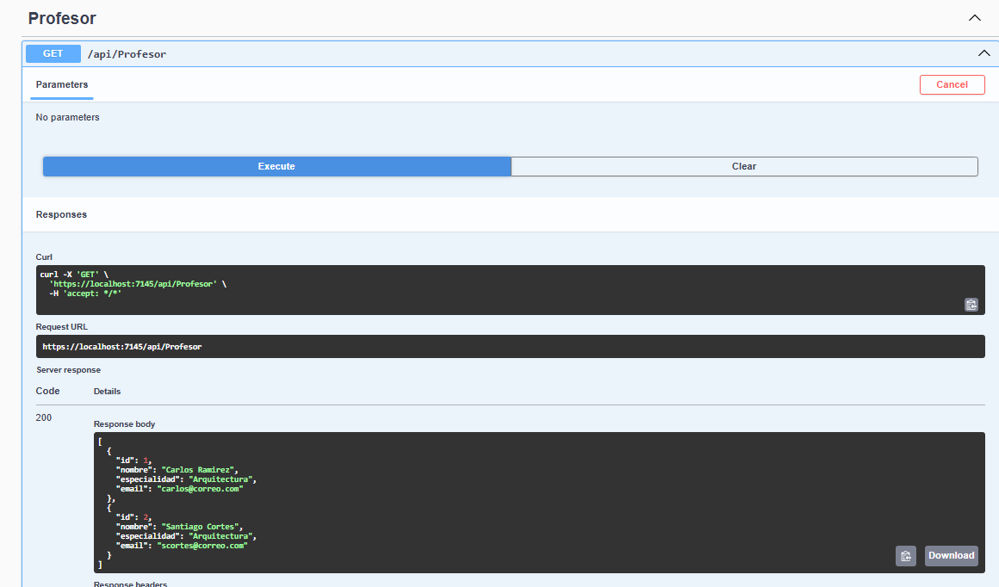

# TALLER PRÁCTICO: Módulo de Gestión de Profes

## Descripción
Objetivo del Taller
Aplicar la arquitectura de N-Capas (Clean Architecture) para implementar el ciclo de vida completo de una nueva entidad, garantizando el uso de DTOs, Servicios, Repositorios y Manejo Global de Excepciones.
___________________________________________________________________________________________________________

**PROFESOR:** Daniel Villamizar
**MATERIA:** Programación de Software
**SEMESTRE:** 2026-1
**ESTUDIANTE:** Santiago Cortés

### 1. Tabla creada en SQL Server

  

### 2. Error por Middleware

  

### 3. Ejecución del endpoint POST en Swagger

  

### 4. Ejecución del endpoint GET en Swagger

  

